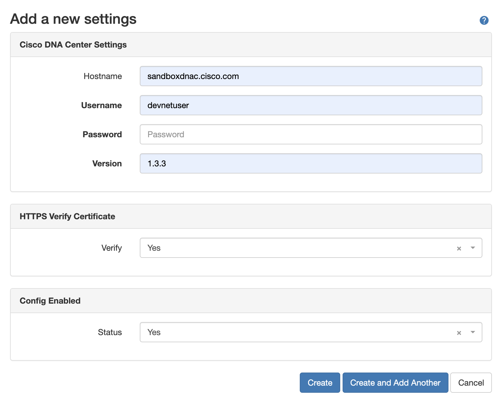
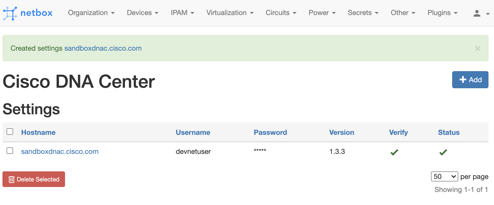
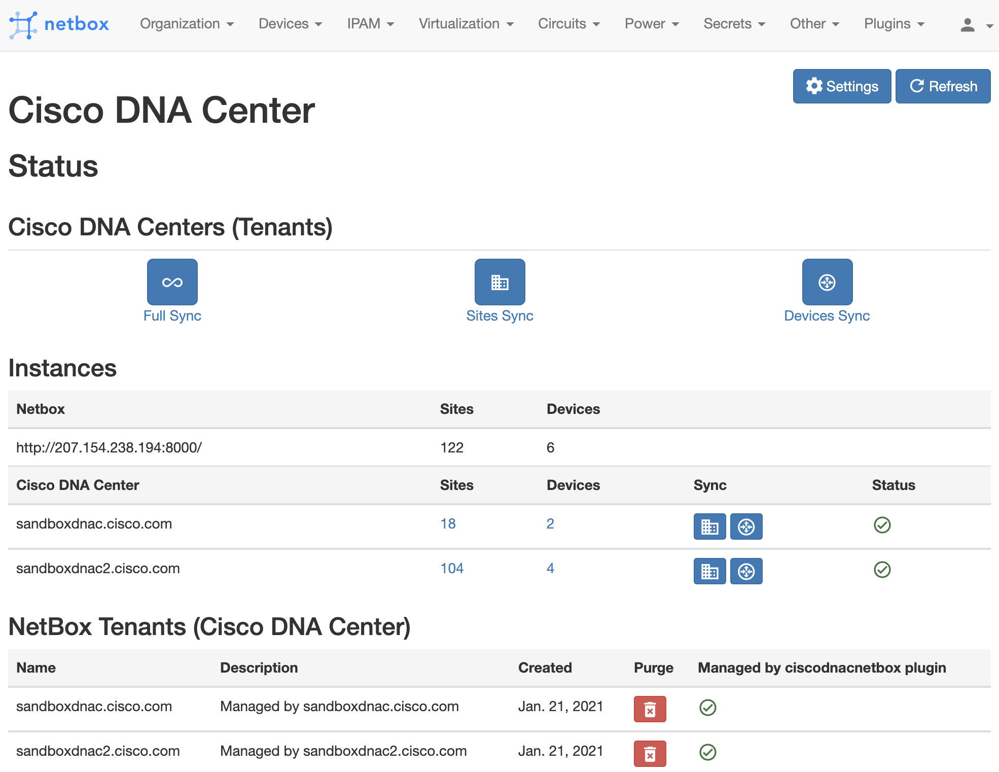
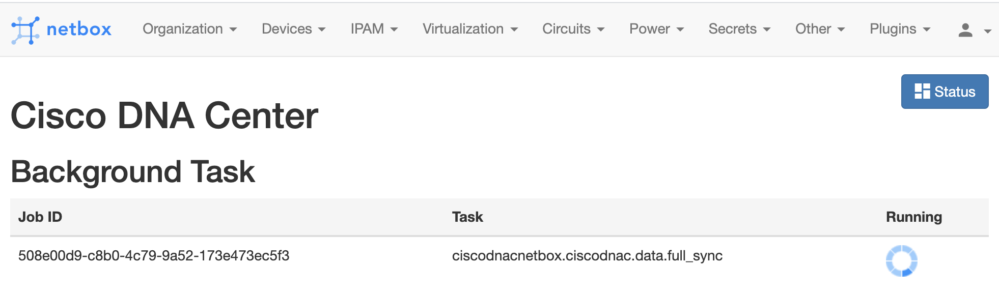
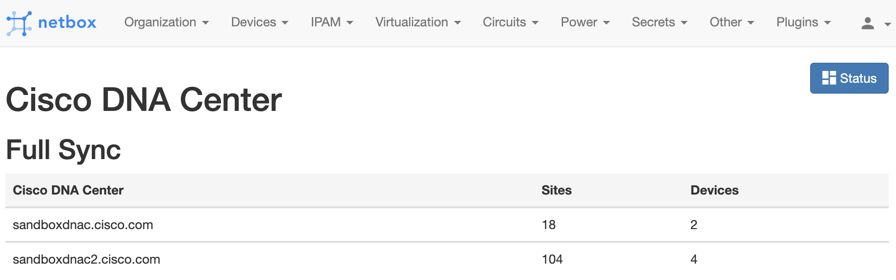
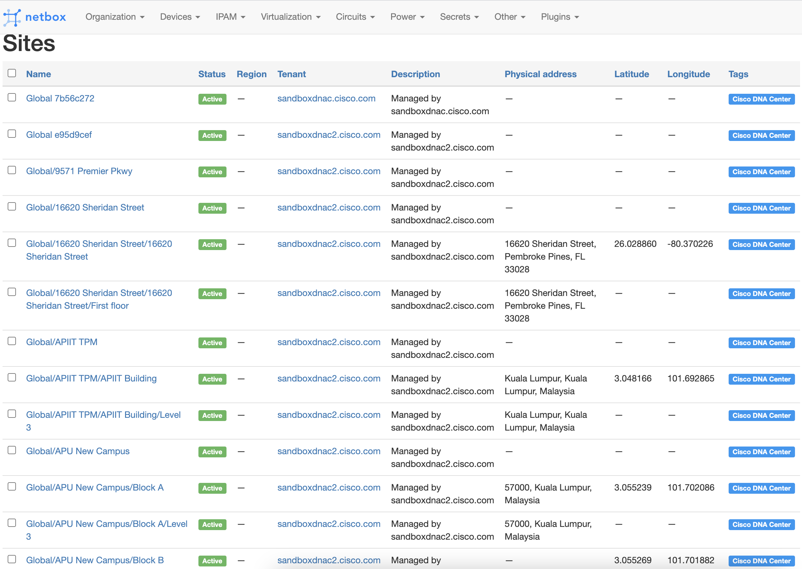
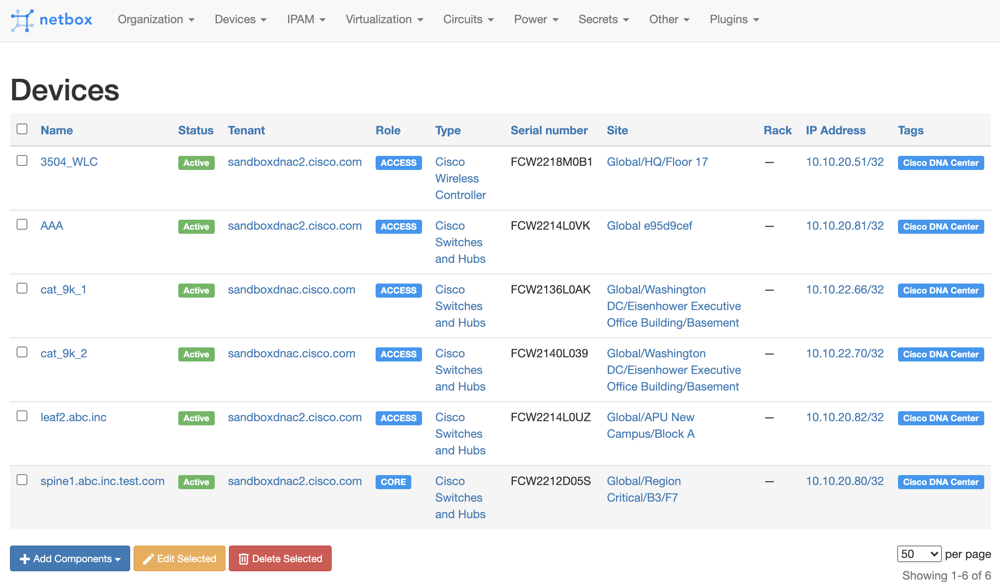

# ciscocatalyustnautobot


*Cisco Catalyst Center Integration with nautobot*

---

```cisco_catalystcenternautobot``` is a nautobot Plugin for Cisco DNA Center.  
It uses the Cisco Catalyst Center Platform APIs to sync data.

## Prerequisites
- Cisco DNA Center
    - Supported release: 2.3.5+
- nautobot
    - Supported release: 1.5
        - version cisco_catalystcenternautobot 3.2.1
- Python
  - Version: 3.3+

## Data that is synced
- [x] Sites
- [x] Devices
- [x] IP Address (/32 of Devices)

## Screenshots
### Settings  
  

### Status  

### Sync  
  

### nautobot Inventory
  


## Getting Started

- Install the plugin from PyPi
    - ```pip install cisco_catalystcenternautobot```

- Enable the plugin in ```configuration.py``` of nautobot
    ```
    PLUGINS = [
        'cisco_catalystcenternautobot',
    ]
    ```
(More details at https://nautobot.readthedocs.io/en/stable/plugins/)

If using Docker with nautobot, follow instructions on https://github.com/nautobot-community/nautobot-docker/wiki/Using-nautobot-Plugins

## Sync your data from Cisco Catalyst Center to nautobot

* Add your Cisco DNA Center(s) in Settings at the cisco_catalystcenternautobot plugin
* Check status dashboard that API calls are OK towards your Cisco DNA Center (refresh if being cached)
* Use the buttons on the Dashboard to sync (Sites is mandatory for Devices to be assigned in nautobot)

## Technologies & Frameworks Used

**Cisco Products & Services:**

- [Cisco Catalyst Center](https://developer.cisco.com/docs/dna-center/#!cisco-dna-center-platform-overview)

**Third-Party Products & Services:**

- [nautobot](https://github.com/nautobot-community/nautobot)

**Tools & Frameworks:**

- [dnacentersdk](https://github.com/cisco-en-programmability/dnacentersdk) (Python SDK)
- [django](https://www.djangoproject.com/)

## Authors & Maintainers


## License

This project is licensed to you under the terms of the [Cisco Sample
Code License](./LICENSE).
